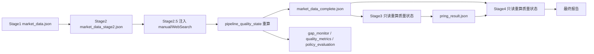

# 数据链路质量状态与窗口指标口径设计

## 背景

当前日报主链路为 `Stage1 -> Stage2 -> Stage2.5 -> Stage3 -> Stage4`。本次审计发现链路可以生成报告，但存在三类会影响可追溯性和结果可信度的问题：

1. `market_data_complete.json` 内 `metadata.missing_items`、顶层 `missing_items`、`quality_blockers`、`gap_monitor`、`policy_evaluation` 可能互相不一致。
2. Stage2/Stage2.5 的 WebSearch 或 manual 数据在最终 JSON 中可能丢失 `source_url`。
3. 部分窗口字段存在口径错配，例如 `daily_change` 实际来自 5 日变化、`ytd_change` 实际来自 120 日变化、占位 `0.0` 被当成真实值。

目标是把数据获取、补数、窗口计算、质量状态、报告前校验收敛到同一套规则，保证从获取数据到生成报告的加工过程完整、可追溯、可阻断。

## 目标

1. 建立统一质量状态计算器，按最终市场数据重新计算 `missing_items`、`quality_blockers`、`manual_required`、`policy_evaluation` 和 `gap_monitor` 兼容视图。
2. 保证 WebSearch/manual 写入的实际数值在最终产物中保留 `source_url`。
3. 统一窗口指标口径，明确 `change_1d`、`change_5d`、`change_30d`、`change_120d`、`ytd_change`、`recent_5d`、`total_120d` 的含义和允许回填规则。
4. Stage3 和 Stage4 不再信任旧状态字段，以统一质量状态器现算结果作为放行依据。
5. `is_estimated=True` 只允许符合指标策略的估算值参与分析，不绕过缺失、过期、compare、policy 或窗口口径质量门。

## 非目标

1. 不引入完整 `run_manifest.json` 作为唯一状态源。
2. 不重构整个 `stage2_5_injector.py` 大脚本，只在必要位置接入统一质量状态器和窗口口径校验。
3. 不处理 legacy 入口，范围限定当前生产主链路。
4. 不全面重写 Pring 资产信号计算，只补齐入口质量校验和状态一致性。
5. 不做全量历史数据回写；旧产物通过重跑 Stage2.5 或后续迁移处理。

## 架构设计

新增模块：

`src/datasource/utils/pipeline_quality_state.py`

核心接口：

```python
state = build_pipeline_quality_state(
    market_payload,
    policy_rules=policy_rules,
    stage="stage2_5" | "stage3" | "stage4",
    allow_estimated=True,
)
```

该模块只计算状态，不联网、不搜索、不修改业务数值。调用方决定是否写回文件。

返回结构：

```python
{
    "missing_items": {...},
    "quality_blockers": [...],
    "manual_required": [...],
    "policy_evaluation": {
        "block_stage3": False,
        "stale_redlist": [],
        "estimated_blockers": [],
    },
    "gap_monitor_view": {
        "pending_tasks": [],
        "manual_required": [],
        "data_quality_issues": [],
    },
    "source_url_issues": [],
    "window_metric_issues": [],
    "warnings": [],
}
```

`gap_monitor` 以后只是兼容视图，不再作为唯一事实源。事实状态来自统一状态器对 `market_data_complete.json` 的实时重算。

## 数据流



## 调用点

### Stage2.5

Stage2.5 是主写回点：

1. 完成 WebSearch/manual 注入。
2. 保留或补齐 `source_url`、估算方法、窗口口径 metadata。
3. 调用 `build_pipeline_quality_state(...)`。
4. 清理旧的 `metadata.missing_items`、顶层 `missing_items`、旧 `quality_blockers` 和旧 `gap_monitor` 阻断状态。
5. 写回新状态到：
   - `market_data_complete.json`
   - `gap_monitor.json`
   - `quality_metrics.json`
   - `policy_evaluation.json`
   - `logs/runs/YYYYMMDD/observability.json`

### Stage3

Stage3 是只读校验点：

1. 读取 `market_data_complete.json` 后立即调用统一质量状态器。
2. Stage3 不再完全信任 JSON 内旧的 `missing_items`、`quality_blockers` 或 `gap_monitor`。
3. 是否进入 Pring 分析，以现算状态为准。
4. 现算结果有 blocking item 时直接阻断；文件内状态和现算状态不一致时记录 warning。

### Stage4

Stage4 是报告前只读校验点：

1. 不只检查 `gap_monitor.pending_tasks/manual_required`。
2. 还要检查现算 `missing_items`、`quality_blockers`、`policy_evaluation.block_stage3`、`source_url_issues`、`window_metric_issues`。
3. 校验 `pring_result.metadata.analysis_date` 和 market data 日期一致。
4. 若 Pring 结果与当前 market data 不匹配，报告生成阻断。

## 来源追溯规则

通用规则：

1. 凡是 Stage2 Tavily/DeepSeek 或 Stage2.5 manual/WebSearch 写入的实际数值，都必须在最终条目保留 `source_url`。
2. `source` 保存短标签，例如 `tavily+deepseek`、`websearch_manual`、`TuShare cn_m`。
3. `source_url` 保存原始证据链接。
4. `note` 保存解释、估算方法、口径说明，但不能替代 `source_url`。
5. 估算值必须同时保留 `is_estimated=true`、`estimation_method`、`source_url`、`metric_basis`、`confidence`。

按类别规则：

1. `macro_indicators`：保留 manual JSON 或 Stage2 extraction 中的 `source_url`。`previous_value/change_rate` 若来自 trend_history，记录前值日期和前值来源。
2. `monetary_policy`：`rrr/mlf/reverse_repo/dr007/m1/m2/tsf` 都保留 `source_url`。`change_from_120d` 若来自事件序列，记录 `base_date` 和 `base_estimated`。
3. `bonds`：WebSearch/manual 注入的债券必须保留 `source_url`。`CN10Y_CDB` 等估算项必须写明 `estimation_method`。
4. `commodities`：自动搜索或 manual 得到的 URL 保留到最终条目。URL 不再只写入 `source` 文本。
5. `forex`：TuShare 来源可无 URL，但 WebSearch 补入必须有 `source_url`。
6. `fund_flow`：manual/WebSearch 补数必须保留 `source_url`。`northbound/southbound` 标记 `metric_basis=net_flow_sum`，`margin` 标记 `metric_basis=balance_delta`，`etf` 估算标记 `metric_basis=estimated_net_flow`。

## 窗口指标口径

### 价格类资产

字段语义：

1. `change_1d`：最近一个有效交易日变化，公式 `(current / previous_1d - 1) * 100`。
2. `change_5d`：近 5 个交易日变化，公式 `(current / value_t-5 - 1) * 100`。
3. `change_30d`：近 30 个交易日变化，主要用于技术分析和波动参考。
4. `change_120d`：近 120 个交易日变化，公式 `(current / value_t-120 - 1) * 100`。
5. `ytd_change`：只表示年初至今，不能用 120 日变化代替。

修正规则：

1. 商品不再把 `change_5d` 回填到 `daily_change`。
2. 商品不再把 `change_120d` 写入 `ytd_change`。如果没有年初基准，报告表头改为“近120日变化”并使用 `change_120d`。
3. 外汇、商品、指数的趋势历史回填都必须记录 `base_date`、`window`、`metric_basis` 和 `confidence`。
4. Stage1/Stage2 创建占位时使用 `None`，不使用 `0.0` 代表未知变化。
5. 对旧产物中的 `0.0`，质量状态器结合 `source`、`stage_task_id`、`manual_required` 判断是否是占位。

### 债券收益率

债券使用 bp 口径：

1. `change_5d_bp = (current_yield - yield_t-5) * 100`
2. `change_120d_bp = (current_yield - yield_t-120) * 100`

若基础序列单位疑似不是收益率百分数，例如值大于 10，标记 `unit_mismatch`，不回填。

### 资金流

字段语义：

1. `recent_5d`：近 5 个交易日累计净流入或净流出。
2. `total_120d`：近 120 个交易日累计净流入或净流出。
3. `metric_basis` 表明计算基础：
   - `net_flow_sum`：日度净流入累计。
   - `balance_delta`：余额差值。
   - `estimated_net_flow`：新闻或人工估算净流入。

修正规则：

1. 北向/南向来自 TuShare `moneyflow_hsgt` 时使用 `net_flow_sum`。
2. 融资融券来自余额变化，使用 `balance_delta`，不能伪装成净流入累计。
3. ETF 如果只能 manual 估算，保留 `is_estimated=true`、`metric_basis=estimated_net_flow`、`source_url`，由策略决定是否放行。

## 质量门规则

### 阻断项

统一质量状态器发现以下情况时应阻断 Stage3 或 Stage4：

1. 现算 `missing_items` 非空。
2. 现算 `quality_blockers` 非空。
3. 现算 `manual_required` 非空。
4. `policy_evaluation.block_stage3=true`。
5. 必填数值缺失、异常零值、占位 0 被当成真实值。
6. WebSearch/manual 数值缺少 `source_url`。
7. 字段口径错配，例如 `daily_change` 来自 5 日变化，`ytd_change` 来自 120 日变化。
8. 核心宏观或货币指标估算值未被策略允许。
9. Pring 结果日期和 market data 日期不一致。

### 允许但必须标记

1. `CN10Y_CDB` 这类策略允许估算的指标，必须带 `is_estimated=true`、`estimation_method`、`source_url`、`confidence`。
2. trend_history 回填窗口不足但非核心阻断时，写入 `trend_history_confidence=low` 和 warning。
3. ETF 估算资金流若策略允许，可进入报告，但报告附录必须显示估算提示。

## 估算值策略

`--allow-estimated` 只放行策略允许的估算，不放行 missing、compare gaps、stale redlist 或 policy redlist。

允许估算的典型场景：

1. `CN10Y_CDB`：无稳定 TuShare 直采口径时，可使用 `CN10Y + 国开-国债利差`，但必须有来源 URL、估算方法、日期和置信度。
2. BDI 等允许使用替代来源时，必须满足来源、日期、单位和证据条件。

默认不允许估算的场景：

1. 核心宏观与货币指标：`CPI/PPI/PMI/M1/M2/TSF` 等。
2. 资金流窗口值，除非显式标记为可接受估算并在报告中披露。
3. 只有单点新闻值、缺少窗口值的 fund flow 数据。

## 测试策略

新增或扩展测试：

1. `test_pipeline_quality_state_clears_stale_missing`：数据已补齐但旧 `missing_items/quality_blockers` 残留时，统一状态器清理旧状态并让 Stage3 通过。
2. `test_source_url_preserved_after_stage25`：覆盖 macro、monetary、bonds、commodities、forex、fund_flow，验证注入后最终 JSON 仍有 `source_url`。
3. `test_window_metric_semantics`：验证 `daily_change` 不能从 `change_5d` 回填，`ytd_change` 不能从 `change_120d` 回填，`change_120d` 使用 t-120 基准。
4. `test_estimated_policy_by_indicator`：`CN10Y_CDB` 满足策略时允许；核心宏观、货币和资金流默认不允许无策略估算。
5. `test_stage4_blocks_inconsistent_quality_state`：`gap_monitor` 空但 `metadata.missing_items` 或现算 blocking 非空时，Stage4 阻断。
6. `test_stage25_stage3_stage4_replay`：轻量回放 Stage2.5 -> Stage3 -> Stage4，验证状态一致、无窗口口径错配、报告不出现误导字段。

## 迁移与风险

1. 商品报告表头需要调整：若没有真实年初基准，使用“近120日变化”而不是“年内涨跌”。
2. 旧产物中已有 `daily_change`、`ytd_change` 混用旧口径，新逻辑不静默信任旧字段。
3. 质量门收紧后，短期可能阻断更多报告生成，这是预期行为。错误信息必须明确到字段和原因。
4. 保持兼容旧顶层 `missing_items`，但写入时以统一状态器现算结果为准。
5. 不做 Run Manifest 和全量历史回写，避免范围扩大。

## 验收标准

1. Stage2.5 后，`market_data_complete.json`、`gap_monitor.json`、`quality_metrics.json`、`policy_evaluation.json` 的阻断状态一致。
2. WebSearch/manual 注入的数值在最终 JSON 中保留 `source_url`。
3. 商品、外汇、指数、债券、资金流的窗口字段和报告表头语义一致。
4. `0.0` 占位不会被当成真实变化值。
5. Stage3 和 Stage4 使用统一质量状态器现算状态放行或阻断。
6. 当前 2026-04-27 这类“完整度 100%，但 missing_items 残留”的产物在重跑 Stage2.5 后能得到一致质量状态。
