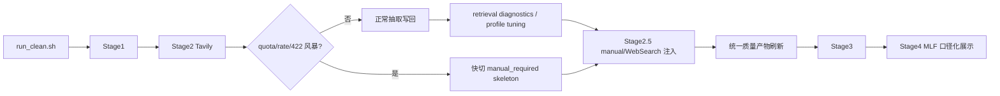

# 日报流水线复盘改进设计

## 背景

2026-04-28 日报生成复盘暴露出四类可复用问题：

1. `run_clean.sh` 强依赖 `.venv/bin/activate`，在 Windows 或依赖安装到系统 Python 的环境下会提前失败。
2. Stage2 Tavily search/extract 出现 quota、rate limit 或 422 风暴时，仍可能继续消耗当日唯一搜索机会，且后续 manual 骨架不够稳定。
3. `estimated_allowlist_keys` 过窄，导致部分高置信 WebSearch/manual 数据被迫通过手工改 `is_estimated=false` 绕过 gate。
4. MLF 多价位或非统一口径在报告中展示成普通 `2.0%`，容易让读者误以为是单一官方固定利率。

目标是把这次复盘转成源头改进：文档同步、运行入口更稳、Stage2 失败快切、估算策略更清晰、报告展示更少误导。

## 目标

1. 同步更新 `AGENTS.md` 和 `CLAUDE.md`，沉淀本次复盘中的长期流程规则。
2. `run_clean.sh` 支持 Windows `.venv/Scripts/activate`，并在缺少虚拟环境时给出明确 fallback 口径。
3. Stage2 不新增 quota 探测请求，而是基于已有 Tavily search/extract 错误信号进行快切。
4. Stage2 快切后，后续任务进入 `manual_required`，并写出可用的 `websearch_results_auto.json`、`gap_monitor.json` 和日志骨架。
5. 扩展估算值策略，区分“高置信 WebSearch/manual 官方口径”与“真实估算”。
6. 修正 MLF 报告展示，让非统一口径显示为参考值或口径不适用，而不是普通利率。
7. 按 DeepSeek 官方文档将默认 DeepSeek 模型切换为 `deepseek-v4-pro`。
8. 提高 Stage2 Tavily 检索到可抽取结果的比例，降低 Stage2.5 手动检索量。
9. 探查并加固 Exa Search 作为 Tavily 后备方案的可用性、触发边界和可观测性。

## 非目标

1. 不引入额外 Tavily quota probe，因为 probe 也可能消耗请求。
2. 不把 ETF 估算资金流加入默认估算白名单；真实估算必须继续显式披露并由 gate 决定。
3. 不重写 Stage2 全部任务调度，只在现有错误处理和结果写出路径上补快切。
4. 不修改当日已生成报告中的历史数据；需要时通过重跑流水线再产出。
5. 不改变“当日 Stage2 Tavily 只跑一次”的硬规则。
6. 不启用与当前 Stage2 抽取无关的工具调用或多轮对话拼接能力。
7. 不把所有 manual_required 都视为检索失败；需要区分检索命中、抽取失败、质量 gate 阻断和缺 key。
8. 不把 Exa 改成默认主搜索源；Exa 只作为 Tavily 搜索失败、无可用片段或 extract 422/cooldown 后的后备路径。
9. 不默认用 Exa 处理北向、南向、ETF、两融等资金流；资金流兜底仍需单独论证来源口径和窗口字段。

## 架构设计

### 文档层

`AGENTS.md` 继续作为权威操作手册，增加：

1. `.venv` 缺失时的运行入口说明。
2. Tavily quota、rate limit、extract 422 风暴后的 manual 路径。
3. Stage2.5 后必须同时检查 `metadata.missing_items`、顶层 `missing_items`、`gap_monitor`、`quality_metrics`、`policy_evaluation`。
4. `--allow-estimated` 的真实作用范围。
5. 高置信 WebSearch/manual 官方口径与真实估算的区别。
6. MLF 多价位或非统一口径展示规则。

`CLAUDE.md` 保持快速索引，只同步高频提醒和入口命令，避免复制完整手册。

### 运行入口

`run_clean.sh` 保持“统一入口”的默认地位，激活优先级：

1. `.venv/bin/activate`
2. `.venv/Scripts/activate`
3. 如果两者都不存在，默认失败并输出系统 Python fallback 命令。

系统 Python fallback 必须显式启用，例如设置环境变量 `ALLOW_SYSTEM_PYTHON=1`。启用后脚本仍会 source `.env`、清理代理，并设置 `PYTHONPATH=./src`。这样可以支持复盘中的系统 Python 场景，又避免静默改变依赖来源。

### Stage2 快切

Stage2 不做单独探测。它只消费现有运行过程中已经产生的信号：

1. Tavily search 抛出 402、403、429、quota、rate limit、payment 等错误。
2. Tavily extract 返回连续 422，且达到 `extract_422_threshold`。
3. Exa fallback 不可用或未安装。

触发快切后：

1. 设置本轮 `tavily_unavailable_reason`。
2. 后续尚未执行的 Tavily 任务不再发 search/extract 请求。
3. 每个跳过任务写入 `manual_required=true` 的结果记录。
4. 记录 `manual_reason`、`query`、`indicator_key`、`category`、`stage_phase`。
5. `gap_monitor.manual_required` 与 `pending_tasks` 包含这些指标。
6. `websearch_results_auto.json` 保留 Stage2.5 可转换的 manual skeleton。

该设计减少无效调用，但不绕过“当日只跑一次”的审计边界。

### Stage2 命中率提升

2026-04-28 实际 Stage2 日志显示，`task_search_success=0` 不能简单理解为 Tavily 没搜到结果。多个指标已有高分可用片段，例如商品、DXY、工业、BDI、MLF、ETF 的 `score_max` 多数高于 0.9，`usable_count_before_extract` 也非零；真正进入 manual 的主要原因包括 `no_deepseek_key`、`deepseek_no_value/no_value`、`extract_422`、`strict_keyword_miss`、`low_score_all` 和估算 gate。

因此命中率改进分三层：

1. 检索层：提高“搜到高质量可用片段”的概率。
2. 抽取层：提高“从片段中抽出数值和 source_url”的概率。
3. 诊断层：把 manual_required 拆成可行动原因，避免把抽取失败误判成 query 命中低。

推荐方案：

1. 新增 Stage2 retrieval diagnostics，不改变联网调用，只从 `query_attempts`、`raw_results`、`usable_count`、`selected_reason`、`manual_reason` 计算：
   - `retrieval_hit_rate`：有 `usable_count>0` 的任务占比。
   - `extract_success_rate`：DeepSeek/regex/Tavily extract 成功抽出主值的占比。
   - `writeback_success_rate`：最终写回 `market_data_stage2.json` 的占比。
   - `manual_reason_breakdown`：按 `no_deepseek_key`、`extract_422`、`strict_keyword_miss`、`low_score_all`、`source_url_missing` 等分类。
2. 增加 profile 级回放调优工具，读最近运行的 `stage_task_log.jsonl` 和 `websearch_results_auto.json`，输出候选改进建议到 `low_score_audit` 或新报告文件，不联网：
   - 哪些 query family 经常被后过滤改选。
   - 哪些指标 `strict_required_keywords` 或 `strict_issuer_match` 过严。
   - 哪些域名返回高分但被路径噪音或关键词过滤误伤。
   - 哪些指标应增加 `field_queries` 或改 `topic=general/time_range/month/day`。
3. 针对高频失败指标做最小 profile 修正：
   - `reserve_ratio` 统一映射到 `rrr`，避免 `reserve_ratio` 无 profile 触发低分泛搜。
   - `CN10Y_CDB` 放宽 issuer 逻辑，从“国家开发银行必须命中”改为允许“中债估值/国开债/政策性金融债/10年”组合命中。
   - `USDCNY` 将中间价、即期价、在岸价分 query family，避免中国银行牌价与 CFETS 即期混在同一严格规则里。
   - `BDI` 降低 Baltic Exchange 老公告误选权重，优先 Trading Economics/Investing 最新历史数据页。
   - 商品与 ETF 对 `extract_422` 默认跳过 Tavily extract，优先 DeepSeek v4-pro 从 snippets 直接抽取，减少 extract 422 导致的冷却。

备选方案：

1. 只增加 query 和域名。实现快，但容易继续把抽取失败误判成检索失败。
2. 全量引入备用搜索源。覆盖面强，但会扩大依赖和运行成本，不适合本批次。
3. 推荐方案：先把已有 Tavily 结果用好，再做少量 profile 修正；这与“当日 Stage2 Tavily 只跑一次”的约束兼容。

### Exa Search 后备探查

当前代码已经有 `src/datasource/adapters/exa_client.py` 和 Stage2 `_try_exa_fallback`，`requirements.txt` 也声明了 `exa-py`。2026-04-28 日志显示 `exa_error=20`、`exa_fallback=0`，说明问题不是“完全没有 Exa 代码”，而是 fallback 失败不可诊断，且无法判断是 key/依赖、API 参数、域名过滤、日期格式还是 Exa 账户状态导致。

官方 Exa Python SDK 文档显示，`Exa(api_key=...)` 可显式传 key，也可读取 `EXA_API_KEY`；`search()` 支持 `contents`、`num_results`、`include_domains`、`exclude_domains`、`start_published_date`、`end_published_date`、`start_crawl_date`、`end_crawl_date` 和 `type`。REST `/search` 同样支持 search + contents，并且 `contents.highlights/text/summary` 会影响返回内容和成本。因此本批次不需要引入新的 `search_and_contents` 抽象，优先校验现有 `search(..., contents=...)` 与当前 `exa-py` 版本兼容。

推荐方案：

1. 增加 Exa 静态健康检查，不发联网请求：确认 `exa-py` 可 import、`EXA_API_KEY` 存在、`Exa.search` 签名或兼容 wrapper 支持 `contents`、`type`、日期和域名参数。
2. 增加显式可选联网探针命令，例如 `scripts/tools/stage2_health_check.py --check-exa-live`；默认日跑不自动探针，避免额外消耗。
3. `_try_exa_fallback` 保留非资金流边界，但记录结构化失败信息：`exa_reason`、`exa_error_type`、`exa_http_status`、`exa_error_tag`、`exa_query`、`exa_domains`、`exa_result_count`、`exa_usable_count`。
4. 当 Tavily 已有 `usable_count>0` 但 Tavily extract 422/cooldown 时，Exa 只能补充片段，不应覆盖已有 Tavily snippets；DeepSeek v4-pro 抽取应优先消费合并后的候选片段，并保留原始 `source_url`。
5. 当 Tavily search 失败、无 snippets 或 strict 过滤后无 usable snippets 时，Exa 可以作为搜索 fallback；若 Exa 失败，继续写 manual skeleton，不吞掉 Tavily 原始错误。
6. Exa 参数按官方名称和当前 SDK 兼容层统一：Python wrapper 对外仍用 `num_results/start_published_date`，内部如需 REST 或新版 SDK 字段转换，必须集中在 `AsyncExaClient`，不要散落在 Stage2。
7. `.env.example` 增加 `EXA_API_KEY=` 注释；`AGENTS.md` 和 `CLAUDE.md` 明确 Exa 是 Tavily 后备，不是必需 key，也不是 Stage2.5 manual 的替代品。
8. Stage2 summary 增加 Exa breakdown，避免只有 `exa_error=20` 这种不可行动计数。

可先落地的最小实现是“健康检查 + 错误分类 + 日志字段 + 测试”，不必先扩大 Exa 覆盖范围。只有当 mock 和一次显式 live probe 证明 Exa 可返回可用片段后，再考虑把更多 `manual_reason=low_score_all/no_snippets` 的非资金流指标接入 Exa。

### DeepSeek 模型切换

根据 DeepSeek 官方中文 API 文档，OpenAI 兼容 base URL 为 `https://api.deepseek.com`，当前模型名包含 `deepseek-v4-flash` 和 `deepseek-v4-pro`，旧模型名 `deepseek-chat`、`deepseek-reasoner` 将于 2026-07-24 弃用。项目默认模型应统一切换为 `deepseek-v4-pro`。

调用约束：

1. `DeepSeekExtractionAgent` 默认 `model` 改为 `deepseek-v4-pro`。
2. `scripts/stage2_unified_enhancer.py --deepseek-model` 默认值改为 `deepseek-v4-pro`。
3. Stage4 资产结论摘要默认模型从 `deepseek-chat` 改为 `deepseek-v4-pro`，仍允许 `DEEPSEEK_SUMMARY_MODEL` 或 `DEEPSEEK_MODEL` 覆盖。
4. `.env.example` 增加 `DEEPSEEK_MODEL=deepseek-v4-pro` 示例，避免新环境继续使用旧名。
5. DeepSeek JSON 抽取继续使用 `response_format={"type": "json_object"}`，prompt 中保留 JSON schema 样例和 `json` 字样。
6. Stage2 默认不强制启用 thinking 模式，避免现有 `AsyncOpenAI` 调用和 JSON 抽取行为发生非必要变化；如后续需要，可通过显式参数或环境变量打开 `extra_body={"thinking": {"type": "enabled"}}` 与 `reasoning_effort="high"`。
7. 文档同步说明旧模型名的弃用时间，提醒不要新增 `deepseek-chat` 默认值。

## 估算策略

`--allow-estimated` 只允许策略白名单内的估算值参与分析，不绕过缺失、过期、compare gaps、policy gate 或 source URL gate。

新增分类：

1. 官方口径 manual/WebSearch：来源为官方或高可信发布方，数值本身不是估算，但通过人工注入获得。应写 `is_estimated=false`，保留 `source_url`、`as_of_date`、`note`。
2. 条件允许估算：如 `CN10Y_CDB`、满足来源和日期条件的 `bdi`。保留 `is_estimated=true`、`estimation_method`、`source_url`、`confidence`。
3. 默认阻断估算：ETF 资金流、缺少直接来源的汇率/商品、核心宏观和货币指标。

`policy_rules.yaml` 可扩展高置信 allowlist，但每项需要条件约束。初始建议：

1. `CN10Y_CDB`：保留现有允许。
2. `bdi`：保留现有条件校验。
3. `mlf`、`reserve_ratio`、`USDCNY`：不作为“估算”默认放行；改为在注入规则中识别官方口径并写 `is_estimated=false`。如果用户显式传入 `is_estimated=true`，仍需要策略条件才放行。

这样避免把“因为手工注入而标估算”和“真实估算”混为一谈。

## MLF 展示

Stage4 生成货币政策表时：

1. 单一官方利率可正常显示，例如 `2.0%`。
2. 多价位中标、参考利率、操作中枢等非统一口径，当前值显示为 `2.0%（参考）` 或同等短标签。
3. 120 日变化列显示 `口径不适用`。
4. 更新日期使用 `date/as_of_date/report_period`。
5. `note` 或来源中包含“多重价位”“中标利率”“参考值”“口径不适用”等标记时触发该展示规则。

## 数据流

## 错误处理

1. `.venv` 缺失且未显式启用系统 Python：脚本失败，提示创建 `.venv` 或设置 `ALLOW_SYSTEM_PYTHON=1`。
2. `.env` 缺失：仍然失败，因为 API key 是必要输入。
3. Tavily quota/rate limit：立即进入本轮快切，日志中保留原始错误。
4. Tavily extract 422：达到阈值后快切 extract；如 search 仍可用，可继续 search 但不再 extract。若复盘要求最小消耗，可配置为后续全任务 manual skeleton。
5. Exa 未安装：记录 `exa_unavailable`，不阻断 manual skeleton 写出。
6. Exa 已安装但调用失败：记录 HTTP status、错误 tag、request id 和可读错误；若无法解析则记录异常类型与消息。
7. Exa 为空结果：记录 `exa_empty` 和 query/domain/date 参数，继续 manual skeleton。
8. Stage2.5 后仍有 `manual_required`：Stage3 继续阻断，不允许靠 `--allow-estimated` 绕过。
9. 检索有结果但抽取失败：记录为 `retrieval_hit_extract_failed`，不计入 Tavily 检索低命中。
10. 严格关键词或发布机构误伤：记录具体规则名和候选 query family，供 profile 回放调优。

## 测试策略

采用 TDD，先写失败测试再实现：

1. `test_run_clean_windows_activate_or_system_fallback`：验证 `.venv/Scripts/activate` 被识别；无 venv 且未显式 fallback 时输出明确错误。
2. `test_policy_manual_official_values_are_not_estimated`：验证官方口径 manual/WebSearch 数据不会因“manual”字样自动变成估算。
3. `test_stage2_quota_fast_switch_writes_manual_skeleton`：模拟 Tavily quota/rate limit 后续任务不再调用 Tavily，并写出 manual skeleton。
4. `test_stage2_extract_422_fast_switch_records_gap_monitor`：模拟连续 extract 422 后生成 `gap_monitor.manual_required`。
5. `test_stage4_mlf_non_unified_rate_display`：验证 MLF 非统一口径显示参考值，120 日变化为 `口径不适用`。
6. `test_deepseek_defaults_use_v4_pro`：验证 `DeepSeekExtractionAgent`、Stage2 CLI 默认值、Stage4 summary 默认值均为 `deepseek-v4-pro`。
7. `test_stage2_retrieval_diagnostics_separates_search_and_extract_failures`：验证有 `usable_count>0` 但 `no_value` 的任务归类为抽取失败，而不是检索失败。
8. `test_stage2_profile_alias_reserve_ratio_to_rrr`：验证 `reserve_ratio` 使用 `rrr` profile，不再泛搜。
9. `test_stage2_cn10y_cdb_relaxed_issuer_quality`：验证国开债中债估值类片段不会被 `strict_keyword_miss` 误杀。
10. `test_stage2_extract_422_prefers_deepseek_snippet_path`：验证配置关闭 Tavily extract 的指标仍会走 DeepSeek snippet 抽取。
11. `test_exa_client_accepts_current_search_contents_signature`：验证 `AsyncExaClient` 对当前 `exa-py` 的 `search(..., contents=...)` 参数兼容。
12. `test_exa_fallback_records_structured_error_metadata`：模拟 400/401/402/429/500，验证 summary 和任务日志能区分错误类型。
13. `test_exa_fallback_preserves_tavily_snippets_on_extract_422`：验证 Tavily 已有可用 snippets 时，Exa 失败不会丢失原候选片段。
14. `test_stage2_exa_live_probe_is_explicit_only`：验证默认 Stage2 不自动发 Exa 探针，只有显式 health check 参数才联网。
15. 文档无需单测，但最终检查 `AGENTS.md` 与 `CLAUDE.md` 是否同步新增高频规则。

## 验收标准

1. `run_clean.sh` 在 Linux venv、Windows venv、显式系统 Python fallback 三种场景有确定行为。
2. Tavily quota/rate limit 或 extract 422 风暴不会导致同轮继续大量无效调用。
3. Stage2 快切产物可直接进入 Stage2.5 manual 补数流程。
4. Stage2.5 后质量状态仍以 `pipeline_quality_state` 统一刷新结果为准。
5. `--allow-estimated` 的文档和代码行为一致。
6. MLF 非统一口径在报告里不再展示成普通单一利率。
7. `AGENTS.md` 和 `CLAUDE.md` 均包含本次复盘沉淀的长期规则。
8. 项目内不再新增 `deepseek-chat` 作为默认模型，DeepSeek 默认路径使用 `deepseek-v4-pro`，且仍支持环境变量或命令行覆盖。
9. Stage2 summary 能同时报告检索命中率、抽取成功率、最终写回率。
10. `reserve_ratio`、`CN10Y_CDB`、`USDCNY`、`BDI` 等高频失败指标的 manual_required 原因减少，或至少给出可行动诊断。
11. Stage2.5 手动检索量下降的判断依据是 `manual_reason_breakdown`，不是单看 `task_search_success`。
12. Exa fallback 在未配置 key、未安装依赖、账户/额度问题、请求参数错误、空结果、成功命中六种状态下都有不同日志和 summary 字段。
13. 2026-04-28 这类 `exa_error=20` 情况能追溯到具体错误类别，而不是只给聚合计数。
14. Exa 不增加 Tavily 请求次数，不破坏“当日 Stage2 Tavily 只跑一次”的审计边界。
15. Exa 仅在非资金流任务中默认启用；资金流若要接入 Exa，需要另起口径设计。

## 自审记录

1. 无空白占位或未完成章节。
2. 没有要求新增 Tavily 探测请求，符合当日只跑一次原则。
3. ETF 估算未加入默认白名单，避免降低资金流数据标准。
4. 文档与代码改动范围一致，均覆盖 A+B+C。
5. Stage2 快切范围限定在现有错误处理和结果写出路径，避免重构扩大。
6. DeepSeek 切换仅改变默认模型名，不默认引入 thinking 模式或多轮 reasoning 拼接。
7. Stage2 命中率改进不新增默认主搜索源，优先利用现有 Tavily 结果、日志回放和少量 profile 修正。
8. Exa 探查纳入同一批设计，但定位为 Tavily 后备加固；默认不扩大主搜索源和资金流口径。
