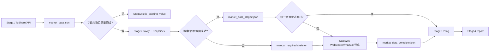

# TuShare Stage1 ETF 与 DXY 上游化设计规格

## 背景

2026-04-29 的本地流水线复盘显示，Stage1 已经覆盖大部分股指、宏观、货币和部分资金流指标；Stage2 对缺口发起 Tavily/DeepSeek 检索抽取，但最终没有给 `market_data_stage2.json` 写入新增有效值；Stage2.5 通过手工 WebSearch 注入补齐了商品、DXY、USDCNY、CN10Y_CDB、工业数据、BDI、货币政策和 ETF 资金流等缺口。

这说明当前最需要优化的不是扩大 Stage2.5 权限，而是把可以被官方结构化接口稳定获取的数据前移到 Stage1。Stage2.5 的定位保持为最后兜底层：只处理 Stage1 和 Stage2 未获取、未补齐窗口、来源证据不足或质量状态仍阻断的数据。

## 目标

1. 将 `fund_flow.etf` 从 Stage2.5 手工估算优先迁移到 Stage1 TuShare `etf_share_size` 推导。
2. 对 `forex.DXY` 增加 Stage1 TuShare `fx_obasic -> fx_daily` 探测，但只有在发现稳定 FXCM basket 代码时启用。
3. 保持 Stage1 -> Stage2 -> Stage2.5 的优先级和责任边界：Stage1 官方结构化采集，Stage2 搜索抽取剩余缺口，Stage2.5 兜底未解决项。
4. 在报告和质量状态中明确数据口径，特别是 ETF 的规模变化推导口径和 DXY 的代理口径。
5. 明确哪些 Stage2.5 数据不能被 TuShare 近似接口强行替代，避免报告可信度下降。

## 非目标

1. 不把 Stage2.5 变成普通覆盖层。Stage2.5 不能覆盖 Stage1/Stage2 已经产出的完整、非过期、质量通过的数据。
2. 不用 TuShare 国内期货、南华指数或其他代理数据替换 `GC=F`、`CL=F`、`BZ=F`、`HG=F`、`BCOM`、`GSG` 这类海外或综合商品口径。
3. 不用 TuShare `repo_daily` 替换央行逆回购政策利率。`repo_daily` 是市场回购行情，不是央行公开市场政策利率。
4. 不用 TuShare `yc_cb` 替换 `CN10Y_CDB`。现有 `yc_cb` 国债曲线不能直接代表 10 年期国开债收益率。
5. 不用 TuShare 宏观月度表强行补工业增加值当月同比、工业销售、BDI、RRR、MLF 多重价位等非同口径字段。
6. 不修改旧报告中的历史数值。所有报告变化都必须通过重跑 Stage1 到 Stage4 产出。

## 数据链路定位

Stage2.5 的触发条件为：

1. Stage1 没有产出对应指标。
2. Stage1 产出值但窗口字段不完整，例如 ETF 缺 `recent_5d` 或 `total_120d`。
3. Stage1 产出值但被标为 `is_stale=True`、`manual_required=True`、异常零值或质量阻断。
4. Stage2 检索、抽取、source_url 校验或写回失败。
5. Stage2 产出后 `pipeline_quality_state` 仍有缺口、过期、估计值阻断或 policy gate 阻断。

Stage2.5 不应在以下场景触发覆盖：

1. Stage1 已有完整同口径 TuShare 值，且质量状态通过。
2. Stage2 已成功写回完整值，且来源证据、日期、窗口字段和质量状态通过。
3. 仅因为 Stage2.5 手工文件中存在同名键，但上游数据没有质量问题。

## TuShare 覆盖结论

| Stage2.5 当前指标 | TuShare 可替代性 | 设计结论 |
| --- | --- | --- |
| `fund_flow.etf` | 可部分前移 | 用 `etf_share_size.total_size` 汇总沪深 ETF 规模，计算 5 日和 120 日规模变化。报告标明“TuShare ETF规模/份额推导”，不是新闻口径净流入。 |
| `forex.DXY` | 可探测代理 | 用 `fx_obasic(classify="FX_BASKET")` 探测 `USDOLLAR.FXCM` 或等价稳定代码，再用 `fx_daily` 取值。报告必须标明 FXCM 美元篮子代理，不默认为 ICE DXY。 |
| `forex.USDCNY` | 不作为本次迁移 | TuShare `fx_daily` 可能是外汇行情口径，不等于央行中间价或 CFETS 即期口径。本次保持 Stage2/Stage2.5。 |
| `commodities.*` | 不替代 | TuShare 国内期货或南华指数不是 Yahoo/海外合约同口径。 |
| `bonds.CN10Y_CDB` | 不替代 | 暂无稳定 TuShare 同口径 10 年国开债曲线。 |
| `macro.industrial` | 不替代 | 当前报告需要当月同比，已有失败案例是抽到累计同比。不能用不匹配字段补。 |
| `macro.industrial_sales` | 不替代 | TuShare 没有直接同口径字段。 |
| `macro.bdi` | 不替代 | BDI 不是 TuShare 稳定官方接口覆盖目标。 |
| `monetary.reserve_ratio` | 不替代 | RRR 调整和当前准备金率口径需要央行或可信发布源证据。 |
| `monetary.reverse_repo` | 不替代 | 央行公开市场逆回购利率不是 TuShare `repo_daily` 市场回购行情。 |
| `monetary.mlf` | 不替代 | MLF 多重价位或中标利率需要保留政策事件口径和参考值展示。 |

## Stage1 ETF 设计

新增 Stage1 ETF 采集路径：

1. 调用 TuShare `trade_cal` 获取最近可用交易日序列。
2. 选取最近交易日、5 个交易日前和 120 个交易日前的交易日。
3. 对每个交易日分别调用 `etf_share_size(exchange="SSE")` 和 `etf_share_size(exchange="SZSE")`。
4. 汇总 `total_size`，按 TuShare 文档单位“万元”换算为“亿元”。
5. 计算：
   - `recent_5d = latest_total_size_yi - size_5d_ago_yi`
   - `total_120d = latest_total_size_yi - size_120d_ago_yi`
   - `trend = "流入"` 当 `recent_5d > 0`，否则为 `"流出"` 或 `"持平"`
6. 写入 `fund_flow.etf`：
   - `type = "ETF资金流"`
   - `source = "TuShare etf_share_size"`
   - `metric_basis = "etf_total_size_delta"`
   - `is_estimated = False`
   - `note = "TuShare ETF规模/份额推导，单位按total_size万元换算，反映ETF总规模变化"`

关键约束：

1. 该口径是 ETF 总规模变化，不是申赎净额、资金净流入或新闻汇总口径。
2. 若 TuShare 权限不足、接口为空、窗口交易日不足或任一窗口总规模不可解析，则 Stage1 不写完整 ETF 值，继续让 Stage2 和 Stage2.5 补。
3. 不保留旧的 `daily_info` 成交额估算作为默认成功路径。若仍保留 legacy fallback，必须显式 `is_estimated=True`，并让质量状态决定是否阻断。

## Stage1 DXY 设计

新增 Stage1 DXY 探测路径：

1. 当 `_fetch_fx_from_tushare("DXY")` 被调用时，不再直接返回 `None`。
2. 优先调用 `fx_obasic(exchange="FXCM", classify="FX_BASKET")` 或等价参数，查找美元篮子代码。
3. 候选代码优先级：
   - `USDOLLAR.FXCM`
   - 名称包含 `USDOLLAR`
   - 名称或代码同时命中 `Dollar`、`USD`、`Basket` 等标识
4. 找到候选后调用 `fx_daily(ts_code=<candidate>)` 获取最近可用日线。
5. 仅当取值落在合理区间且日期可用时写入 `forex.DXY`。
6. 写入字段：
   - `pair = "DXY"`
   - `name = "DXY（TuShare FXCM美元篮子代理）"`
   - `source = "TuShare fx_daily FXCM proxy"`
   - `note = "TuShare FX_BASKET代理口径，不等同ICE DXY"`
   - `as_of_date = 最近可用交易日期`

关键约束：

1. TuShare DXY 路径默认是代理探测，不是同口径官方 ICE DXY 直采。
2. 报告中必须暴露代理口径，不能只显示普通 `DXY`。
3. 若找不到稳定代码、接口为空、数值越界或日期缺失，则 Stage1 返回空，继续由 Stage2 和 Stage2.5 兜底。
4. Stage2 的合理区间保护继续保留，避免网页抽取错误或代理值异常进入报告。

## 报告与质量状态设计

报告需要体现数据从采集到展示的完整链路：

1. Stage4 只读取 `market_data_complete.json` 和 `pring_result.json`，不从历史 `reports/*.md` 复用数据。
2. ETF 如果来自 Stage1 TuShare，资金流表或附注应显示“TuShare ETF规模/份额推导”。
3. ETF 如果来自 Stage2.5 手工估算，必须保留 `is_estimated=True` 或估算警示，不能伪装成官方直采。
4. DXY 如果来自 Stage1 TuShare FXCM proxy，外汇表应显示代理名称或来源，避免被读者理解为 ICE DXY。
5. `pipeline_quality_state` 需要识别 fund_flow 的 `is_estimated=True`，并在 Stage4 附录或质量警示中呈现。
6. `Stage2 skip_existing_value` 应只在 Stage1 数据完整且质量通过时发生。

2026-04-29 报告复盘中的问题需要在后续实现中避免：

1. ETF 文字说明包含估算含义时，不应在质量状态里当作普通非估计值。
2. `CN10Y_CDB` 若仍是估算值，报告可以展示，但质量附录必须继续提示估算和策略约束。
3. Stage2 检索命中率和最终写回率要分开看。搜索命中不等于报告字段已补齐。

## 文件边界

计划修改：

1. `scripts/stage1_data_collector.py`
   - 增加 ETF `etf_share_size` 汇总和窗口计算。
   - 增加 DXY `fx_obasic -> fx_daily` 探测。
   - 保留 Stage1 失败后交给 Stage2/Stage2.5 的缺口语义。
2. `src/datasource/models/market_data_contract.py`
   - 给 `FundFlowData` 增加可选 `is_estimated`。
   - 给 `ForexData` 增加可选 `as_of_date` 和 `note`。
3. `src/datasource/generators/simple_report.py`
   - 展示 ETF 推导口径。
   - 展示 DXY 代理口径。
   - 将 fund_flow 估算项纳入估算警示。
4. `AGENTS.md` 和必要时 `CLAUDE.md`
   - 同步长期口径和运行规则。
5. 测试文件：
   - `tests/test_stage1_data_collector.py`
   - `tests/test_stage2_unified.py`
   - `tests/test_simple_report_integration.py`
   - `tests/test_pipeline_quality_state.py`

不计划修改：

1. `scripts/stage2_5_injector.py` 的兜底职责。
2. `src/datasource/config/search_profiles.py` 的搜索 profile。
3. Tavily、DeepSeek 客户端实现。
4. 历史报告和历史运行产物。

## 错误处理

ETF：

1. `etf_share_size` 权限不足、接口异常或返回空表时，Stage1 记录原因并返回空。
2. 任一窗口日期缺失或 `total_size` 不可解析时，不写部分窗口值。
3. `recent_5d` 和 `total_120d` 必须同时存在，否则进入 Stage2/Stage2.5。
4. 合计值为 0 或负数异常时，不作为有效 Stage1 值写入。

DXY：

1. `fx_obasic` 无 FX_BASKET 结果时返回空。
2. 找不到稳定美元篮子候选代码时返回空。
3. `fx_daily` 无最近可用记录时返回空。
4. 值不在合理区间时返回空，并保留 Stage2/Stage2.5 兜底。

通用：

1. Stage1 的新增路径不能抛出未捕获异常中断全量采集。
2. Stage1 失败应保留缺口，让 Stage2 继续生成 `manual_required` 或补值。
3. Stage2.5 只处理缺口或质量阻断项，不主动覆盖有效上游值。

## 测试计划

1. ETF helper 测试：模拟 SSE 和 SZSE `etf_share_size`，验证合计和单位换算。
2. ETF window 测试：模拟交易日和三个窗口日期，验证 `recent_5d`、`total_120d`、`trend`、`metric_basis`。
3. ETF failure 测试：接口空表、窗口不足、单侧交易所缺失时，不写完整值。
4. DXY discovery 测试：模拟 `fx_obasic` 返回 `USDOLLAR.FXCM`，验证随后调用 `fx_daily`。
5. DXY fallback 测试：无候选代码、无日线、数值越界时返回空。
6. Stage2 skip 测试：Stage1 ETF/DXY 完整且质量通过时，Stage2 不再为它们消耗搜索任务。
7. Stage2.5 fallback 测试：Stage1 ETF 只有单窗口或 DXY 探测失败时，Stage2/Stage2.5 缺口仍保留。
8. Report 测试：ETF 显示“TuShare ETF规模/份额推导”，DXY 显示 FXCM 代理口径。
9. Quality 测试：fund_flow `is_estimated=True` 进入估算警示或质量阻断，不被忽略。

## 验收标准

1. `fund_flow.etf` 在 TuShare `etf_share_size` 可用时由 Stage1 产出完整 `recent_5d` 和 `total_120d`。
2. ETF Stage1 产物带有 `metric_basis="etf_total_size_delta"`，报告中可见“TuShare ETF规模/份额推导”。
3. DXY 仅在 FXCM 美元篮子代理代码稳定且 `fx_daily` 有值时由 Stage1 产出。
4. DXY 报告名称或来源可见“FXCM美元篮子代理”。
5. 当 ETF 或 DXY Stage1 不满足条件时，Stage2 和 Stage2.5 的兜底链路仍按原规则工作。
6. 商品、国开债、工业数据、BDI、RRR、逆回购和 MLF 没有被 TuShare 近似接口静默替换。
7. `pipeline_quality_state` 能识别 fund_flow 的估算状态。
8. Stage4 报告不从历史报告复用数据，仍完全来自当前运行产物。
9. 相关单元测试和聚焦集成测试通过。

## 用户复核点

1. 是否接受 ETF 使用“规模变化推导”作为 Stage1 默认口径，但在报告中明确不是净申赎或新闻净流入。
2. 是否接受 DXY 使用 FXCM 美元篮子代理作为 Stage1 可选前移路径，并在报告中明确代理性质。
3. 是否继续保持商品、CN10Y_CDB、工业、BDI、RRR、逆回购和 MLF 不做 TuShare 近似替换。

## 自检记录

1. 已明确 Stage2.5 是 Stage1 和 Stage2 未解决数据的兜底层，不是普通覆盖层。
2. 已区分 TuShare 可前移字段、可探测代理字段和不可替代字段。
3. 已把报告展示和质量状态纳入设计，覆盖“数据到报告”的完整路径。
4. 已保留 Stage2 一日一次和 Stage2.5 手工来源证据约束。
5. 已列出实现文件、非修改文件、错误处理、测试计划和验收标准。
